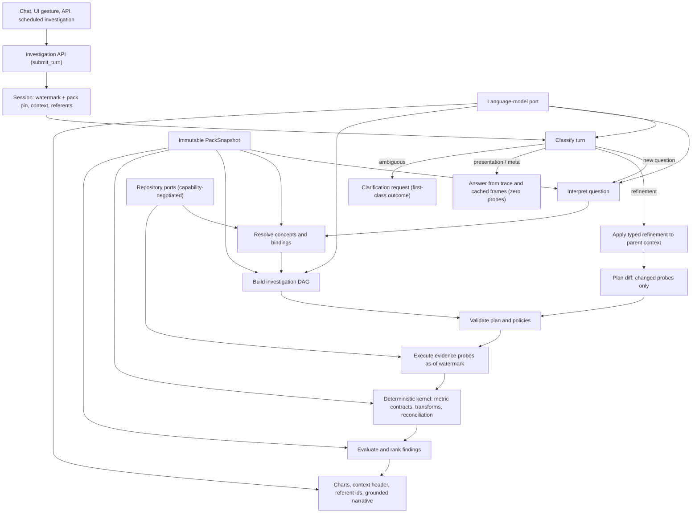

# Design: Extensible Conversational Investigation Platform for RCM Analytics

**Status:** Revised architecture (v2)
**Supersedes:** v1 proposal
**Audience:** Implementation agent
**Primary language:** Python
**Initial deployment:** Modular monolith in a monorepo
**Future deployment:** Independently deployable capabilities without rewriting business logic

## Revision summary (v1 → v2)

- Added first-class support for multidimensional queries with arbitrary dimensions, filters, and time windows over governed semantics (§2.3, §6).
- Replaced the single `EvidenceProbe` with a closed probe union and a deterministic transform-operator algebra; retrieval and transformation are now separate layers (§2.4, §6).
- Introduced `EvidenceFrame` as the typed interchange structure between probes, transforms, findings, and presentation (§6.4).
- Added a conversational investigation model: sessions, turn classification, typed refinement operators, cohorts, referent resolution, carryover laws, and a runtime reconciliation invariant (§7).
- Introduced data-watermark pinning for investigations and sessions; as-of reads are a repository capability (§2.6, §6.3, §7.1).
- Resolved metric-definition authority between the pack and Snowflake Semantic Views (§5.6).
- Hardened metric contracts: scope dimensions, date-basis rules, and three named correctness laws (§5.3).
- Typed `PackDelta.definition` and analyst corrections; added refinement-sequence mining to the learning loop (§9).
- Expanded APIs, error codes, observability, security mechanics, testing, phasing, and acceptance criteria accordingly (§12–§18).
- Reframed Phase 1 as a thin vertical slice with one design-partner tenant; trimmed transport plurality to in-process + HTTP until Phase 5 (§17).
- Added companion-document dependencies, including the operator-algebra document that blocks Phase 2 completion (§20).

## 1. Objective

Build a conversational analytics platform that lets healthcare revenue-cycle-management analysts ask broad or ambiguous questions such as:

- "Do I have a COB issue?"
- "What are the top five things I should look at today?"
- "Why did cash decline last week?"
- "Which denial problems are actionable?"

The system must combine deep RCM understanding with exploratory data analysis while ensuring that calculations, rankings, and charts are reproducible and deterministic.

The platform is conversational in a strong sense. Analysts ask an opening question and then refine it across turns — drilling into findings, cutting by different dimensions, narrowing scope, shifting time windows, and referring back to earlier results ("those claims," "the second one," "that payer"). Two requirements are therefore first-class in this design:

1. **Arbitrary analytical scope.** Multidimensional queries with arbitrary combinations of dimensions, filters, and time windows over governed semantics, without new code per combination.
2. **Typed, replayable follow-ups.** Drill-downs, pivots, comparisons, and context edits that are deterministic, reconcilable with what the analyst was previously shown, and reproducible from the trace.

The platform is built as an RCM product with clean seams. RCM-specific knowledge is supplied through a versioned domain pack rather than embedded throughout the application code. Framework extraction for other domains is a later, earned step — not a first-release objective.

## 2. Core design principles

### 2.1 Questions compile into investigations

Do not implement this as unrestricted natural-language-to-SQL.

A question compiles into a typed investigation containing:

- Interpreted intent and concepts.
- Candidate hypotheses.
- Required evidence.
- Candidate semantic bindings.
- An evidence-probe DAG.
- Metric contracts.
- Conclusion policies.
- Presentation requirements.

SQL is one infrastructure-level representation of an evidence probe.

Follow-up turns do not re-compile from scratch. A follow-up compiles into a typed **refinement** of a parent investigation's resolved context (§7). First turns compile; later turns edit.

### 2.2 Probabilistic control plane, deterministic data plane

The LLM may:

- Interpret language.
- Identify possible RCM concepts.
- Generate hypotheses.
- Suggest bindings and probes.
- Select investigation strategies.
- Classify conversational turns.
- Resolve anaphora to referent identifiers from the live registry.
- Emit refinement operators from the closed set in §7.4.
- Suggest chart types.
- Compose a narrative from certified findings.

The LLM may not independently:

- Calculate financial values.
- Define metric meaning at runtime.
- Choose unvalidated joins silently.
- Treat proxies as direct evidence.
- Apply a refinement outside the closed operator set.
- Carry conversational context implicitly — context is an explicit typed object (§7.2).
- Perform arithmetic on evidence frames outside versioned kernel operators.
- Promote new domain knowledge.
- Rewrite the production pack.
- State conclusions unsupported by recorded evidence.

Calculations, metric evaluation, transform operators, policy enforcement, ranking, reconciliation, and chart data must use versioned deterministic components.

### 2.3 Meaning is governed; scope is free

"Arbitrary dimensions, filters, and time windows" does not conflict with governed metrics, because the two are separated cleanly:

- A **metric contract** fixes what a number *means*: formula, entity grain, date basis, denominator, exclusions, sign.
- The user freely chooses *where to point it*: which dimensions to cut by, which population to scope to, which window to examine.

Every scope element must resolve against the semantic catalog. Scoping over certified dimensions never requires review. Scoping over uncertified fields is permitted, but downgrades the entire evidence chain to discovery grade, which conclusion policies already treat accordingly.

Arbitrary scope over certified semantics is not arbitrary SQL. It is bounded by the catalog, the planner's validation pass (§6.6), and query budgets.

### 2.4 Retrieval and transformation are separate layers

Probes retrieve typed aggregate frames from the warehouse. A deterministic **transform-operator algebra** in the analytical kernel — versioned platform code, never pack content — transforms frames: compare, delta, share-of-total, ratio, rank, reconcile, decompose.

This split is what makes "arbitrary" tractable: the probe language stays small enough for the planner to fully validate, while analytical richness lives in pure, testable functions over bounded results.

It also answers who may compute a ratio the pack never defined: the kernel may, deterministically, with provenance pointing at the operator version and input facts. Arithmetic over certified meanings is not new meaning.

### 2.5 Follow-ups are typed edits to explicit context

"Now break that down by payer" is never re-interpreted from scratch. It applies a small typed delta to the parent investigation's resolved context. On a follow-up, the LLM's job shrinks to classifying the turn and emitting refinement operators from a closed set; everything downstream is deterministic.

This is both more reliable — nothing else silently shifts — and the only way to make multi-turn behavior replayable.

### 2.6 Investigations and sessions pin data state

Every investigation is pinned to a `DataWatermark` in addition to a `PackSnapshot`. Every probe in a session reads as-of the session's watermark.

This is a prerequisite for both new requirements: two probes within one investigation executed minutes apart during a warehouse load can observe inconsistent data, and drill-down children must reconcile to the parent numbers the analyst was just shown. Snowflake time travel makes as-of reads cheap on the current backend; the DuckDB contract twin uses snapshot copies.

Mid-session data refresh is an explicit, surfaced event — never a silent one (§7.1).

### 2.7 The pack is compiled from evidence

The RCM pack is neither manually written in full nor generated wholesale by an LLM.

The safe operating rule is:

> The LLM proposes; evidence promotes.

The LLM creates atomic, provenance-backed `PackDelta` proposals. Deterministic validation, historical replay, shadow execution, and risk-based approval determine whether proposals enter production.

### 2.8 Unknown questions are expected

The pack is not an exhaustive list of supported questions. A question follows one of four paths:

1. **Governed:** A validated playbook directly covers it.
2. **Composed:** Existing concepts, the analytical algebra (§6), and transform operators construct an investigation.
3. **Exploratory:** The system discovers candidate fields, values, and relationships.
4. **Indeterminate:** Available data cannot support a reliable conclusion.

The system must never convert missing coverage into a confident "no issue" answer.

At any point in interpretation or refinement, the system may return a **clarification request as a first-class outcome** rather than guessing. Ambiguity is a dialogue move, not an error.

An honest non-answer is a designed deliverable, not a dead end: it states what was checked, what evidence is missing, and what data or instrumentation work would resolve it — turning "cannot conclude" into an actionable data-quality work order.

### 2.9 Deployment is an infrastructure decision

Core capabilities interact through typed APIs. A capability may be called:

- In-process.
- Over HTTP.
- Over gRPC.
- Through an asynchronous queue.

Business logic must not know which transport is active.

A monorepo and microservices are compatible. Begin with a modular monolith in a monorepo, then extract capabilities only when scaling, ownership, security, release cadence, or fault isolation justifies it.

## 3. High-level architecture



## 4. Bounded capabilities

### 4.1 Semantic Catalog

Responsibilities:

- Expose available measures, dimensions, entities, and relationships.
- Resolve domain concepts against semantic metadata.
- Search column descriptions and documented synonyms.
- Profile candidate fields and values.
- Classify and mask PHI **before** any profile or metadata leaves the capability boundary toward a model.
- Apply small-cell suppression to profiles.
- Sanitize column descriptions and free-text metadata as untrusted input at the boundary (runtime prompt-injection defense, not only offline evaluation).
- Report data coverage, binding confidence, and dimension cardinality estimates for planner budgeting.
- Hide Snowflake Semantic View implementation details.

### 4.2 Investigation Engine

Responsibilities:

- Manage session lifecycle: creation, watermark and pack pinning, epoch transitions on data refresh.
- Classify conversational turns (§7.3) and orchestrate the appropriate path.
- Interpret a question.
- Retrieve the applicable pack snapshot.
- Construct hypotheses.
- Resolve candidate bindings.
- Build and validate an evidence DAG.
- Apply typed refinements to parent contexts and compute plan diffs.
- Maintain the referent registry and cohort definitions/materializations for the session.
- Coordinate probe execution.
- Return a versioned investigation record linked into session lineage.

### 4.3 Calculation Engine (deterministic analytical kernel)

Responsibilities:

- Evaluate metric contracts.
- Perform aggregations, comparisons, reconciliations, and impact calculations.
- Provide the versioned transform-operator algebra (§6.5) as pure functions over evidence frames.
- Enforce grain, date, denominator, exclusion, and sign rules.
- Enforce the three kernel laws (§5.3): denominator law, slicing law, grade law.
- Run the automatic drill-down reconciliation invariant (§7.8).
- Produce facts with provenance.
- Never depend on LLM-generated arithmetic.

### 4.4 Pack Registry

Responsibilities:

- Store immutable pack versions.
- Assemble base, organization, and tenant overlays under the merge rules in §5.4.
- Identify snapshots by content hash over composed layers.
- Resolve dependencies.
- Retrieve pack snapshots.
- Store candidate changes and evaluation reports.
- Promote, quarantine, deprecate, and roll back artifacts.

### 4.5 Pack Learning and Evaluation

Responsibilities:

- Mine investigation traces, refinement sequences, context corrections, and clarification patterns.
- Identify coverage gaps and repeated successful trajectories.
- Generate candidate `PackDelta` objects.
- Deduplicate proposals by fingerprint; apply backpressure when the review queue backs up rather than re-proposing solved problems.
- Run static validation, replay, fault injection, and shadow comparison.
- Route only material semantic decisions for human review.

This capability is offline and cannot mutate the active pack directly.

### 4.6 Presentation

Responsibilities:

- Convert deterministic results into chart specifications.
- Apply presentation recipes from the pack.
- Display the **effective context header** on every answer: window, date basis, active filters, cohort, watermark (§7.2).
- Assign and surface stable referent identifiers on findings, cohorts, chart series, and table rows (§7.6).
- Emit refinement operators from chart interactions — clicking a bar compiles to the same `DrillInto` a sentence would (§7.4).
- Make truncation and suppression visible, never silent.
- Compose narratives using only certified findings.
- Attach evidence and calculation provenance.
- Distinguish facts, inferences, proxies, and missing evidence.

## 5. Domain-pack model

A runtime pack snapshot is assembled as:

```text
generic analytical kernel
        +
base RCM pack
        +
organization overlay
        +
tenant bindings and policies
        =
immutable PackSnapshot
```

The transform-operator algebra belongs to the analytical kernel — versioned platform code. Packs configure *which* concepts, metrics, playbooks, and policies exist; packs never define new arithmetic.

### 5.1 Pack artifacts

The pack may contain:

- **Concepts:** COB, denial, underpayment, clean claim, secondary billing.
- **Aliases:** Analyst language and organization terminology.
- **Binding recipes:** How concepts may map to semantic fields.
- **Metric contracts:** Formula, grain, dates, exclusions, denominator, sign, scope dimensions (§5.3).
- **Playbooks:** Parameterized investigation DAG templates.
- **Detectors:** Anomaly and comparison policies.
- **Conclusion policies:** Evidence required to make specific claims.
- **Ranking policies:** How findings are prioritized.
- **Presentation recipes:** Appropriate charts and explanatory structure.
- **Evaluations:** Positive, negative, ambiguous, and missing-data cases — now including anaphora and carryover-ambiguity sets, and golden conversations (§16).

### 5.2 Semantic fingerprint

Every governed metric or concept must have a stable identity and fingerprint containing:

- Formula or expression tree.
- Entity and grain.
- Numerator and denominator.
- Date basis.
- Join path.
- Filters and exclusions.
- Sign convention.
- Organization or tenant scope.
- Effective dates.
- Provenance.
- Dependencies.

Meaning-changing revisions create a new version. Existing meaning is never silently overwritten.

### 5.3 Metric-contract scope rules and kernel laws

Metric contracts gain two declarations in v2:

- **`scope_dimensions`:** which dimensions are legal cuts for this metric. Default: the certified dimensions of the contract's entity grain. Clean-claim rate by payer is meaningful; clean-claim rate by CARC is nonsense, and the planner rejects it with `GRAIN_INCOMPATIBLE`.
- **Date bases:** a primary basis plus allowed alternates. "Cash by service date" is a different, still-meaningful metric than "cash by post date." Using an allowed alternate is permitted but labeled in output and provenance; using a disallowed basis yields `DATE_BASIS_INVALID`.

Three laws are stated as kernel law, enforced by the Calculation Engine, and never left to implementers:

1. **The denominator law.** A user scope filter on a ratio metric applies to the contract-defined population — numerator and denominator alike. A filter that scopes only the numerator has changed the metric's meaning, which only a new contract version may do.
2. **The slicing law.** Ratio metrics under any slicing compute ratio-of-sums per cell, never average-of-ratios.
3. **The grade law.** Every transform output carries the weakest evidence grade among its inputs. Proxy evidence cannot launder into a certified conclusion through arithmetic.

### 5.4 Overlays and merge semantics

Composition is not free-form. The merge rules are:

- Overlays **may** override: aliases, presentation preferences, ranking weights within governed bounds, tenant-specific bindings, detector thresholds within declared ranges.
- Overlays **may not** override metric formulas, denominators, grain, date basis, financial-impact rules, or join paths except through the top-tier approval path (§9.5), which creates a new contract version rather than an in-place override.
- Conflict resolution for permitted classes: tenant > organization > base.
- A `PackSnapshot` identity is a content hash over the composed layers.
- A tenant may pin a base version while the base advances; base revisions that change meaning require migration notice to affected tenants before adoption.
- Tenant-learned artifacts are tenant-scoped by default. Generalization into organization or base layers requires governed review, including PHI and competitive-information scrubbing.

### 5.5 Candidate bindings

A binding maps a domain concept to available data. Bindings progress through:

```text
proposed → observed → validated → certified → deprecated
```

Each binding must declare its evidence strength:

- **Direct:** The field explicitly represents the concept.
- **Derived:** The concept is deterministically calculated from validated fields.
- **Proxy:** The field is correlated with the concept but does not prove it.
- **Unavailable:** No adequate measurement currently exists.

Discovery tools may operate without certified bindings. Governed conclusions require bindings that meet the applicable conclusion policy. The grade law (§5.3) propagates these strengths through every downstream transform.

### 5.6 Decision: pack versus Snowflake Semantic View authority

Two definitional sources will otherwise drift, and drift is precisely the silent-meaning-change failure the fingerprint system exists to prevent. The decision:

- **The pack is authoritative for meaning.** Metric contracts in the pack are the single source of semantic truth.
- Snowflake Semantic Views are an **ingestion source** (their metadata is fingerprinted into candidate contracts through the normal proposal pipeline) and a **compilation target** (adapters may compile probes against them).
- Scheduled **drift detection** compares warehouse-side definitions against pack fingerprints. Detected drift quarantines the affected binding and opens a review item; it never silently updates the contract.

Rejected alternative: treating Semantic Views as authoritative would place meaning changes outside pack versioning, replay, and rollback.

## 6. Logical analytical algebra

This section replaces the v1 "logical query abstraction." Application services must never create or accept raw Snowflake SQL. They operate on the typed algebra below.

### 6.1 Scope objects

Time gets real semantics. RCM has five or more date bases, and a window is a range *on a basis*, with a calendar policy, because period comparisons in a posting-driven business must choose between calendar-day and business-day alignment:

```python
@dataclass(frozen=True)
class TimeWindow:
    basis: DateBasisRef              # service | post | submission | remit | discharge
    range: AbsoluteRange             # concrete dates, resolved once at plan time
    requested: RelativeRange | None  # original spec ("last full week") kept for re-anchoring
    calendar: CalendarRef            # business-day vs calendar-day alignment policy

@dataclass(frozen=True)
class Comparison:
    kind: ComparisonKind             # PRIOR_PERIOD | PRIOR_YEAR | CUSTOM
    window: TimeWindow               # derived deterministically from the primary window
```

Relative ranges resolve against the investigation's pinned as-of timestamp exactly once, at planning time; the trace stores the concrete dates. Replay uses the stored dates. This is what makes "last week" deterministic after the fact.

Grain splits into two orthogonal axes. The v1 single `Grain` conflated the fan-out axis (claim vs line vs transaction) with the bucketing axis (day vs month); that conflation is the classic RCM error:

```python
@dataclass(frozen=True)
class Grain:
    entity: EntityGrain              # CLAIM | LINE | ENCOUNTER | TRANSACTION | REMIT
    time_bucket: TimeBucket | None   # DAY | WEEK | MONTH | None
```

Filters are a small closed algebra rather than a flat tuple:

```python
FilterExpr = And | Or | Not | Predicate | InCohort

@dataclass(frozen=True)
class Predicate:
    dimension: DimensionRef
    op: PredicateOp                  # EQ | NEQ | IN | NOT_IN | RANGE | IS_NULL | CONTAINS
    values: tuple[Scalar, ...]

@dataclass(frozen=True)
class InCohort:
    cohort: CohortRef                # membership in a prior result's entity set (§7.5)
```

`InCohort` is the single most important addition in this revision. It is the primitive that makes drill-downs well-defined: "those claims" becomes membership in a pinned cohort, compiled by the repository adapter as a semi-join against a materialized set. It is also the **only** mechanism for inter-probe data flow in the DAG — downstream probes consume upstream results through cohort references, never through ad hoc value splicing.

### 6.2 Evidence probes as a closed union

`EvidenceProbe` becomes a discriminated union, because the platform's own target questions require more than one retrieval shape. AR aging is a point-in-time state question, not a flow aggregation; modeling it as one produces confidently wrong numbers.

```python
@dataclass(frozen=True)
class AggregationProbe:
    measures: tuple[MetricRef, ...]
    dimensions: tuple[DimensionRef, ...]
    scope: FilterExpr
    window: TimeWindow
    grain: Grain
    having: tuple[MeasurePredicate, ...] = ()   # post-aggregation filters
    order_by: tuple[Ordering, ...] = ()
    limit: int | None = None                     # server-side top-N

@dataclass(frozen=True)
class SnapshotProbe:
    """State as-of a date: AR aging, open inventory, work-in-progress."""
    measures: tuple[MetricRef, ...]
    dimensions: tuple[DimensionRef, ...]
    scope: FilterExpr
    as_of: date
    aging_basis: DateBasisRef | None             # e.g., bucket AR age by service or post date
    grain: Grain

@dataclass(frozen=True)
class RowEvidenceProbe:
    """Row-level examples. Authorization-gated, sampled, purpose recorded in trace."""
    columns: tuple[FieldRef, ...]
    scope: FilterExpr
    window: TimeWindow | None
    sample: SamplePolicy
    purpose: str

EvidenceProbe = AggregationProbe | SnapshotProbe | RowEvidenceProbe
```

`order_by` plus `limit` belongs in the probe because server-side top-N over high-cardinality dimensions is a pure win. Per-group top-N and all other ranking belong in the transform layer, over bounded frames. That is the line: probes express retrieval shapes the semantic layer can fully verify; transforms express analysis.

**Deferred probe kinds:** sequence and funnel probes (payer-order analysis, touch sequences) are named as future members of the union and deliberately deferred (§17, §19). Do not emulate them by abusing `AggregationProbe`.

### 6.3 Repository port and capability negotiation

```python
@dataclass(frozen=True)
class RepositoryCapabilities:
    as_of_reads: bool
    cohort_semijoin: bool
    max_cohort_size: int | None
    having_pushdown: bool
    server_side_top_n: bool

class AnalyticalRepository(Protocol):
    def capabilities(self) -> RepositoryCapabilities: ...

    async def execute(
        self, probe: EvidenceProbe, *, watermark: DataWatermark
    ) -> EvidenceFrame: ...

    async def materialize_cohort(
        self, definition: CohortDefinition, *, watermark: DataWatermark
    ) -> CohortMaterialization: ...
```

The planner checks capabilities at validation time, yielding `SOURCE_CAPABILITY_UNSUPPORTED` rather than a runtime adapter failure. This keeps the swap-the-backend acceptance criterion honest as the algebra grows.

The Snowflake adapter compiles logical probes into Snowflake SQL or Semantic View operations, using time travel for as-of reads. The DuckDB adapter serves as the contract-test twin and replay backend. Probe fusion — compiling two probes that differ only in period into one warehouse query — is an adapter-level optimization, invisible above the port.

Cohort materialization strategy (temp table vs hash set vs re-derived predicate) is decided per adapter and constrained by `max_cohort_size`; watch this at scale.

No Snowflake cursor, Snowpark DataFrame, warehouse identifier, or database exception may cross the repository boundary. Snowflake's Python drivers are synchronous; the async protocol implies threadpool wrapping in the adapter — decided here, consciously.

### 6.4 EvidenceFrame

Probes and transforms exchange one typed structure:

```python
@dataclass(frozen=True)
class EvidenceFrame:
    schema: FrameSchema          # columns bound to DimensionRef / MetricRef + contract versions
    rows: tuple[FrameRow, ...]
    watermark: DataWatermark
    provenance: ProvenanceRef    # probe id, or transform op + input frame refs
    evidence_grade: EvidenceGrade  # weakest grade among sources (grade law)
    truncated: bool
    suppressed_cells: int        # small-cell suppression applied at frame level
```

Frames are where small-cell suppression is enforced (aggregates leak in small cohorts), where truncation is made visible rather than silent, and what findings, charts, and the narrative composer consume.

### 6.5 Transform operators

The kernel ships a versioned, closed operator set — pure functions `EvidenceFrame(s) → EvidenceFrame`:

```python
class TransformOperator(Protocol):
    version: OperatorVersion
    def apply(self, *frames: EvidenceFrame) -> EvidenceFrame: ...
```

Initial operator set:

- `compare(a, b, join_on)` — absolute and relative deltas, period alignment via calendar policy.
- `share_of_total(frame, over)`.
- `ratio(frame, numerator, denominator)`.
- `delta(frame, against)`.
- `top_k(frame, by, k, per_group=None)` and `rank(frame, by)`.
- `reconcile(parent, children)` — runs automatically on drill-downs (§7.8).
- `reshape` / `pivot` for presentation-bound frames.
- `decompose(parent, children, policy)` — volume/rate/mix/timing attribution. The operator is named here; its methodology is specified in the operator-algebra companion document (§20), which blocks Phase 2 completion.

All operators enforce the slicing law and propagate evidence grade per the grade law (§5.3). Operators are kernel code: the learning loop cannot propose new operators, and packs cannot define arithmetic.

### 6.6 Planner validation pass

Every composed probe — whether from a first-turn plan or a refinement diff — passes:

1. Resolve every dimension and filter against the catalog; assign evidence grade per element.
2. Check dimension legality against the metric contract's `scope_dimensions` (`GRAIN_INCOMPATIBLE` on failure).
3. Check date-basis validity against the contract (`DATE_BASIS_INVALID` on failure).
4. Estimate group-by cardinality from catalog profiles; require top-N or reject over budget (`QUERY_BUDGET_EXCEEDED`).
5. Warn when a user predicate intersects a contract's internal exclusions or denominator definition — the "denial rate for denied claims" confusion — and surface the interaction in the answer.
6. Apply suppression policy to the plan.
7. Negotiate repository capabilities (`SOURCE_CAPABILITY_UNSUPPORTED`).
8. Enforce tenant authorization, row/time/cost limits, and read-only access.

## 7. Conversational investigation model

This section is new in v2 and defines follow-ups, drill-downs, and context handling.

### 7.1 Sessions and lineage

A conversation is a **session**. Investigations remain immutable; a follow-up creates a *new* investigation node linked to its parent by a typed `Refinement` edge, so a session is a DAG of investigations. This preserves every immutability and replay property while giving the trace true lineage: it is inspectable exactly how an analyst navigated from "why did cash decline" to "those three payers' CARC mix."

The session pins `DataWatermark` and `PackVersion` at creation. Every probe in the session reads as-of the watermark. If the warehouse refreshes mid-session, the system surfaces it — "data has been refreshed since this investigation began" — and the analyst explicitly continues pinned or re-anchors, which starts a new watermark epoch recorded in the trace.

### 7.2 Explicit context

The resolved state a follow-up edits is a first-class object:

```python
@dataclass(frozen=True)
class InvestigationContext:
    window: TimeWindow
    comparison: Comparison | None
    scope: FilterExpr              # each clause tagged with its origin turn
    cohort: CohortRef | None
    grain: Grain
    watermark: DataWatermark
    pack_version: PackVersion
    pins: tuple[ContextPin, ...]   # user-declared sticky elements
```

**Hard presentation requirement:** every answer displays its effective context — a compact header stating window, date basis, active filters, cohort, and watermark. This is the design's main defense against the cardinal failure of conversational analytics: silent scope drift. When context is always visible, carryover mistakes are caught by the analyst in seconds instead of discovered in a reconciliation weeks later.

### 7.3 Turn taxonomy

Each user turn is classified before anything else happens:

- `NEW_INVESTIGATION` — fresh context.
- `REFINEMENT` — typed edit to a parent context.
- `PRESENTATION_ONLY` — re-chart, re-sort, reword; zero probes executed.
- `CONTEXT_CONTROL` — "clear filters," "keep this scope for the session."
- `META` — "why do you say that?" answered from the trace; zero probes.
- `CLARIFICATION_RESPONSE` — answering a clarification the system asked.

Low-margin classification between new-question and refinement does not guess — it asks. Clarification is a first-class outcome, not an error.

### 7.4 Refinement operators

The closed set the LLM may emit:

```python
@dataclass(frozen=True)
class SetDimensions:
    dimensions: tuple[DimensionRef, ...]

@dataclass(frozen=True)
class DrillInto:
    target: ReferentId            # a finding, dimension value, or chart element
    # resolves to a CohortRef; narrows scope via InCohort

@dataclass(frozen=True)
class Pivot:
    measures: tuple[MetricRef, ...]  # same cohort, different measure family

Refinement = (
    SetDimensions | AddFilter | RemoveFilter |
    SetWindow | SetComparison | SetGrain |
    DrillInto | Pivot | Explain |
    RankBy | Expand | ResetContext
)
```

Each operator names exactly what it changes; everything else is inherited. `SetGrain` triggers full re-validation, because grain changes can invalidate metric compatibility. `Explain` requests decomposition of a specific finding and dispatches to the `decompose` operator.

The closed set buys something beyond reliability: **chart interactions compile to the same operators.** Clicking a bar in a payer chart *is* `DrillInto(payer=X)`. Natural language and UI gestures converge on one algebra, one validator, one trace format — interactive presentation is future-proofed for free.

### 7.5 Cohorts

```python
@dataclass(frozen=True)
class CohortRef:
    id: str
    definition: CohortDefinition          # intensional: scope + window + grain
    pinned: CohortMaterialization | None  # extensional: entity ids at a watermark
    origin: ReferentId                    # the finding/probe/element it came from
    size: int
```

The intensional/extensional duality is deliberate and must not be collapsed:

- **Within a session,** drill-downs use the **pinned** materialization, so child numbers reconcile with what the analyst was shown.
- **Across sessions,** re-running the same investigation re-evaluates the **definition** against fresh data.

The trace records both, so "why do these numbers differ from yesterday" is answerable from provenance.

Cohort materializations are tenant-scoped, access-controlled like row-level evidence, and TTL-bound to session retention — a pinned set of claim identifiers is itself sensitive data.

### 7.6 Referents and anaphora

"Those claims," "the second one," "that payer" resolve against a **referent registry**: findings, cohorts, chart series, and table rows receive stable ids (F1, F2, …) that the presentation layer surfaces. The LLM resolves anaphora *to referent ids*, which are validated for existence. Unresolvable or low-confidence references yield `REFERENT_NOT_FOUND` or a clarification — never a guess.

Surfacing the ids gives the analyst and the model shared handles: a small UI convention doing heavy semantic lifting.

### 7.7 Carryover laws

Stated as law so no implementer improvises them:

1. Refinements inherit the full parent context and change only what they name.
2. Topic shift starts a fresh context; uncertain classification asks.
3. Cohort narrowing composes (drill within drill); widening is always explicit (`RemoveFilter`, `ResetContext`).
4. Contradictions — "exclude Medicaid" while the active cohort is Medicaid-only — are detected *before* execution and surfaced as `CONTEXT_CONFLICT`, rather than returning a silently empty result.
5. Session pins persist until explicitly cleared.

### 7.8 The reconciliation invariant

When a drill-down decomposes an aggregate the analyst was shown, the kernel automatically inserts a `reconcile(parent, children)` check: children must sum to the parent within suppression tolerance, at the shared watermark. Failure is flagged in the answer (`RECONCILIATION_FAILED`), never silently displayed.

This promotes the offline harness's ratio-of-sums and fan-out tests into a *runtime* guarantee at exactly the moment fan-out bugs, filter drift, and watermark drift would otherwise reach the analyst. It is the single cheapest trust-building mechanism in the conversational layer.

### 7.9 Execution economics

A refinement produces a `PlanDiff`; only changed probes execute. Kernel-only refinements — re-rank, expand top-N within an untruncated frame, re-chart — execute **zero** warehouse queries, as do `PRESENTATION_ONLY` and `META` turns.

The **evidence cache**, keyed on `(probe hash, watermark, pack version)`, is a requirement, not an optimization: sibling drill-downs share most of their probe set, and the cache simultaneously serves cost, latency, and cross-turn consistency.

Per-tenant budget policies cover combined warehouse and LLM spend, with attribution in the trace.

### 7.10 Determinism boundary, restated for conversations

Turn classification, referent resolution, and refinement extraction are probabilistic — validated against the closed operator set and the live referent registry. Everything after the typed operators is deterministic.

Consequently, golden *conversations* replay from recorded operators, not from natural language. That is what makes multi-turn behavior testable at all. Question-to-plan remains best-effort and versioned; plan-to-numbers is deterministic. Traces recording model and prompt versions provide auditability of the probabilistic half, not replayability of it — the design claims only the latter for the deterministic half.

## 8. Runtime investigation workflow

### 8.1 First turn (compile path)

1. Accept a typed request containing tenant, question, authorization, time context, and optional pack version.
2. Open or join a session; pin `PackSnapshot` and `DataWatermark`. If the warehouse is mid-load, return `DATA_LOADING` or surface staleness rather than answering from inconsistent state.
3. Classify the turn (`NEW_INVESTIGATION` on a first turn).
4. Interpret the question into structured intent hypotheses.
5. Retrieve relevant concepts, metrics, playbooks, and prior validated bindings.
6. If necessary, ask the Semantic Catalog to discover and profile candidate fields.
7. Resolve scope: window (concrete dates), grain, filters, comparison.
8. Construct a typed evidence DAG over the probe union; inter-probe flow only via cohorts.
9. Run the planner validation pass (§6.6).
10. Compile logical probes through the configured analytical repository; execute as-of the watermark; record immutable evidence frames.
11. Evaluate metric contracts and transform operators deterministically in the kernel.
12. Apply conclusion and ranking policies.
13. Generate chart specifications from certified frames; register referents; attach the effective-context header.
14. Ask the LLM to compose a narrative constrained to those facts.
15. Persist the complete trace, including uncertainty and unsupported branches, linked into session lineage.

### 8.2 Follow-up turn (refinement path)

1. Classify the turn; on ambiguity, return a clarification.
2. Resolve any referents against the registry.
3. Emit refinement operators from the closed set; validate them structurally.
4. Apply operators to the parent `InvestigationContext`; detect contradictions (`CONTEXT_CONFLICT`) before execution.
5. Compute the `PlanDiff`; re-run the planner validation pass on changed probes.
6. Execute only changed probes (evidence cache first) as-of the session watermark.
7. Run kernel transforms; run the reconciliation invariant against the parent where applicable.
8. Evaluate findings; present with lineage, updated referents, and the effective-context header.
9. Persist the new investigation node and its `Refinement` edge.

### 8.3 Presentation-only and meta turns

Answered from the trace and cached frames. Zero probes, zero warehouse queries. `META` turns ("why do you say that?") cite the recorded evidence and calculation provenance for the referenced finding.

## 9. Pack-learning workflow

### 9.1 Evidence sources

The learning capability may ingest:

- Authoritative or licensed RCM reference materials.
- Organization-approved policies, metric definitions, and SOPs.
- Snowflake Semantic View metadata and lineage (under the authority rule in §5.6).
- Approved dashboards and reports.
- Analyst-approved or corrected SQL.
- Schema profiles and value distributions.
- Completed investigation traces.
- **Refinement sequences.** A repeated path — denial rate → by payer → by CARC → drill top payer — is a playbook-branch proposal writing itself.
- **Context corrections.** Repeated corrections ("no, keep Medicaid excluded") are default-scoping proposals.
- Explicit analyst corrections (typed; see below).
- Unsupported questions, clarification patterns, and repeated clarification requests.
- Repeated successful investigation paths.

Observed usage can suggest changes, but cannot establish semantic truth by popularity alone.

Analyst corrections are captured in a typed schema, not mined from free text:

```python
@dataclass(frozen=True)
class AnalystCorrection:
    target: CorrectionTarget   # BINDING | CALCULATION | THRESHOLD | SCOPE | RANKING | NARRATIVE_CLAIM
    referent: ReferentId | None
    detail: str
    session_id: str
    investigation_id: str
```

### 9.2 Memory separation

Maintain three distinct stores:

1. **Experience memory:** Raw traces, discoveries, corrections, and patterns. Untrusted.
2. **Candidate memory:** Proposed pack artifacts awaiting evaluation.
3. **Governed pack:** Immutable promoted artifacts available to production.

Production runtime may consult experience memory for exploration, but must clearly label it as unvalidated.

### 9.3 Atomic pack proposals

The LLM produces a small typed change rather than regenerating a pack:

```python
@dataclass(frozen=True)
class PackDelta:
    artifact_type: ArtifactType
    operation: DeltaOperation
    definition: ArtifactDefinition        # discriminated union per artifact type —
                                          # never Mapping[str, object]
    evidence_refs: tuple[str, ...]
    dependencies: tuple[str, ...]
    risk_class: RiskClass
    expected_behavior: tuple[ExpectedBehavior, ...]
    proposed_tests: tuple[TestCase, ...]
```

`ArtifactDefinition` is a typed discriminated union (one definition type per artifact type). The single most safety-critical object in the system must not be stringly typed.

The proposal must include provenance, scope, expected coverage gain, affected dependencies, and proposed tests.

### 9.4 Promotion pipeline

```text
observe
→ propose
→ static validation
→ executable validation
→ historical replay
→ fault injection
→ shadow execution
→ optional canary
→ promote
→ monitor and rollback
```

An LLM may generate tests, but it cannot be the only test oracle.

Validation must include deterministic checks, authoritative comparisons, held-out cases, negative controls, and invariants.

### 9.5 Risk-based promotion

Changes that can generally be automated after validation:

- Additive synonyms.
- Search and retrieval indexes.
- Exact metadata lineage.
- Evaluation paraphrases.
- Documentation links.
- Performance changes with identical results.

Changes that require shadowing or targeted review:

- New playbook branches (including those mined from refinement sequences).
- Candidate proxy mappings.
- Anomaly policies.
- Ranking changes.
- New organization-wide bindings.

Changes that require explicit domain or data-owner approval:

- Metric formulas.
- Denominators.
- Grain or date basis.
- Financial-impact rules.
- Join paths.
- Payer-specific interpretations.
- Authorization or PHI behavior.
- External actions or write-off recommendations.

Feedback, clicks, query success, and acceptance are prioritization signals — not semantic proof. Ranking learning from clicks, even confined to ordering, must include exploration or holdouts to avoid rich-get-richer loops that entrench blind spots.

**Reviewer economics are part of the design.** The promotion pipeline must specify reviewer roles, expected proposal volume, and review SLAs (§20). When the queue backs up, the learning loop deduplicates by fingerprint and stops re-proposing — it must not burn tokens and warehouse credits rediscovering solved problems.

## 10. Worked examples

### 10.1 COB investigation learning

For a first-time question such as "Do I have a COB issue?":

1. Interpret COB as coordination-of-benefits process performance.
2. Retrieve known COB concepts, codes, signals, and hypotheses.
3. Search semantic metadata for direct or proxy fields.
4. Profile candidate values and date coverage (PHI-masked, suppression applied).
5. Examine payer sequence, other-insurance indicators, CARCs/RARCs, secondary billing, and related workflow signals where available.
6. Construct and execute an exploratory evidence DAG.
7. Distinguish direct COB evidence from proxy evidence; the grade law carries the distinction through every calculation.
8. Produce deterministic calculations and a coverage-qualified conclusion.
9. Record discovered bindings, investigation structure, and analyst corrections.

If similar investigations recur, the Pack Builder proposes new aliases, tenant-specific bindings, a parameterized COB playbook, direct-versus-proxy rules, missing-data tests, and historical replay cases. The patch is validated and shadowed before promotion. Future investigations reuse the promoted knowledge instead of rediscovering it.

### 10.2 "Top five things today"

This request uses a portfolio investigation:

1. Identify the organization's RCM profile and available data coverage.
2. Activate relevant issue-family branches from the pack.
3. Execute branches concurrently where safe.
4. Detect anomalies, deterioration, materiality, and actionable opportunities.
5. Rank findings using a governed policy.
6. Return five findings with evidence, impact, confidence, and recommended drill-downs.

**Runtime posture:** portfolio investigations are **scheduled and pre-materialized**, refreshed on data-load completion, not computed on demand. The interactive request serves the cached portfolio; each returned finding carries referents so drill-downs proceed as ordinary refinements against the portfolio's pinned watermark.

The ranking policy remains distinct from metric definitions. Usage may improve ordering preferences, but clicks must never redefine the underlying financial calculations.

### 10.3 Multi-turn drill-down (new in v2)

**T1 — "Why did cash decline last week?"**
Classified `NEW_INVESTIGATION`. Window resolves to concrete dates on the post-date basis (the contract's primary basis), calendar policy business-day-aligned; comparison = prior period. Probes execute; kernel computes deltas; findings F1–F3 registered (e.g., F2: "Payer group X down $412K vs prior week"). Answer carries the context header: *Window: Jul 27–Aug 2 (post date) vs Jul 20–26 · Scope: all · Watermark: 2026-08-03 04:10.*

**T2 — "Break that down by payer."**
Classified `REFINEMENT`; "that" resolves to the investigation's primary measure. Operator: `SetDimensions(payer)`. Everything else inherited. One changed probe executes; `reconcile` confirms payer rows sum to the parent decline. Each payer row gets a referent id.

**T3 — "Just the top three payers — what's the CARC mix on their denials?"**
Operators: `DrillInto(top-3 payer rows)` → pinned `CohortRef` via `InCohort`; `Pivot(denial measures)`; `SetDimensions(CARC)`. Planner validates CARC as a legal cut for the denial metric's line grain. If a denial signal for one payer is proxy-grade, the frame — and the answer — carry proxy grade per the grade law.

**T4 — "Compare that to Q1."**
Operator: `SetComparison(CUSTOM, Q1)`. Only comparison-side probes execute; primary-side frames come from the evidence cache. Windows re-anchor deterministically from stored concrete dates.

**T5 — "Why do you say F2?"**
Classified `META`. Answered from the trace: probes, contract versions, operator applications, and reconciliation results behind F2. Zero warehouse queries.

The session trace records the full DAG: T1's investigation, three refinement edges, one cohort with both definition and pinned materialization, every operator, and every cache hit.

## 11. Python clean architecture

### 11.1 Dependency rule

```text
entrypoints → application → domain
infrastructure → application ports and domain
```

The domain and application packages must not import infrastructure.

### 11.2 Domain layer

Contains POPOs, value objects, domain services, and policies:

- `Investigation`, `InvestigationPlan`, `PlanDiff`
- `Session`, `InvestigationContext`, `Refinement` (union), `TurnClass`
- `TimeWindow`, `Comparison`, `Grain`, `FilterExpr`, `Predicate`, `InCohort`
- `EvidenceProbe` (union), `EvidenceFrame`, `Evidence`
- `CohortRef`, `CohortDefinition`, `CohortMaterialization`, `ReferentId`
- `DataWatermark`, `RepositoryCapabilities`
- `MetricContract`, `Finding`, `BindingCandidate`
- `PackSnapshot`, `PackDelta`, `ArtifactDefinition`, `PromotionDecision`
- `AnalystCorrection`

Use dataclasses, enums, `Decimal`, dates, and typed collections.

### 11.3 Application layer

Contains use-case coordination:

- `OpenSessionService`
- `ClassifyTurnService`
- `InterpretQuestionService`
- `ResolveReferentsService`
- `ApplyRefinementService`
- `ResolveBindingsService`
- `BuildInvestigationPlanService`
- `DiffPlanService`
- `ExecuteInvestigationService`
- `CalculateMetricsService`
- `EvaluateFindingsService`
- `BuildPackCandidateService`
- `EvaluatePackCandidateService`
- `PromotePackService`

Domain invariants — including the carryover laws, the kernel laws, and the reconciliation invariant — belong in domain objects or policies. Application services orchestrate them.

### 11.4 Infrastructure layer

Contains replaceable adapters:

- Snowflake catalog and analytical repositories (time travel for as-of reads; threadpool wrapping of synchronous drivers).
- DuckDB analytical repository — contract-test twin and replay backend.
- Evidence cache keyed on `(probe hash, watermark, pack version)`.
- Session and referent-registry store; cohort materialization store (tenant-scoped, TTL-bound).
- Pack and trace persistence.
- LLM providers (BAA-covered endpoints; see §15).
- Vector or document search.
- Chart renderers.
- HTTP and queue clients.
- Observability and event-bus adapters.

### 11.5 Suggested package layout

```text
packages/
  shared-kernel/                 # scope objects, frames, watermark, refs, grades

  investigation-contracts/
  investigation/                 # sessions, turns, refinements, referents,
                                 # cohorts, planning, plan diffing

  semantic-catalog-contracts/
  semantic-catalog/              # incl. PHI classification/masking, sanitization

  calculation-contracts/
  calculation/                   # metric contracts + transform operator kernel
                                 # + kernel laws + reconciliation

  pack-registry-contracts/
  pack-registry/                 # incl. overlay merge rules, snapshot hashing

  pack-learning/
  presentation/                  # context headers, referent ids,
                                 # gesture → refinement compilation

  connector-snowflake/
  connector-duckdb/              # contract twin + replay backend
  adapter-openai/
  adapter-vega/

apps/
  modular-monolith-api/
  investigation-worker/
  portfolio-scheduler/           # pre-materialized "top five" portfolio runs
  pack-learning-worker/

  # Future packaging targets
  investigation-service/
  pack-registry-service/

deploy/
  monolith/
  distributed/
```

Avoid generic `BaseService` and `BaseRepository` class hierarchies. Prefer narrow `Protocol` interfaces and composition.

## 12. Capability APIs

Each bounded capability exposes a small application facade and a versioned public contract. Internal domain objects are private. Public Pydantic DTOs handle serialization and validation.

```python
class InvestigationApi(Protocol):
    async def open_session(
        self, request: OpenSessionRequest
    ) -> SessionResponse: ...

    async def submit_turn(
        self, request: TurnRequest
    ) -> TurnResponse: ...
    # TurnRequest carries either a natural-language utterance
    # or a typed Refinement — UI gestures submit typed refinements
    # directly and bypass NL entirely.

    async def get_investigation(
        self, investigation_id: str
    ) -> InvestigationResponse: ...

    async def get_session_lineage(
        self, session_id: str
    ) -> SessionLineageResponse: ...
```

Provide transport-specific clients (`InProcessInvestigationClient`, `HttpInvestigationClient`; gRPC and queued clients are Phase 5). A consumer depends only on `InvestigationApi`. Dependency injection determines the transport.

### API rules

- Do not expose internal domain objects directly.
- Do not expose raw SQL or provider-specific errors.
- Version public contracts.
- Include tenant, authorization, idempotency, and correlation context explicitly.
- Return job identifiers for long-running operations; investigations stream progress or complete asynchronously with notification. Interactive latency will be tens of seconds to minutes — the interaction model must assume it.
- `CLARIFICATION_REQUIRED` is a first-class successful outcome type on `TurnResponse`, not an error code.
- Use stable error codes:

```text
BINDING_AMBIGUOUS
INSUFFICIENT_EVIDENCE
UNSUPPORTED_CONCEPT
POLICY_DENIED
SOURCE_UNAVAILABLE
QUERY_BUDGET_EXCEEDED
AMBIGUOUS_REFINEMENT
REFERENT_NOT_FOUND
CONTEXT_CONFLICT
GRAIN_INCOMPATIBLE
DATE_BASIS_INVALID
WATERMARK_STALE
DATA_LOADING
RECONCILIATION_FAILED
SOURCE_CAPABILITY_UNSUPPORTED
```

A capability must not access another capability's tables or repositories directly. This is enforced at the warehouse, not only by convention: schema-per-capability with role separation applies even in monolith mode (§15).

## 13. Runtime versus verification harness

The architecture is intentionally asymmetrical.

### Online runtime: relatively light

The runtime harness provides:

- Dependency injection.
- Request validation.
- Authorization and tenant context.
- Pack-version and watermark pinning.
- Timeouts, query budgets, and per-tenant spend policies.
- Structured LLM output validation — including refinement operators against the closed set and referents against the live registry.
- Evidence tracing and the evidence cache.
- Error normalization.
- Idempotency and correlation.

Avoid introducing a general workflow engine or distributed service infrastructure initially.

### Offline verification: intentionally dense

The evaluation harness provides:

- Frozen warehouse snapshots.
- Golden investigations.
- **Golden conversations:** scripted multi-turn sessions replayed from recorded refinement operators against frozen data.
- Current-versus-candidate replay.
- Metric and semantic invariants.
- **Algebraic property suites:** shares sum to one modulo suppression; ratio-of-sums under arbitrary slicing; compare antisymmetry; reconcile within tolerance; refinement locality (apply operator, diff contexts, assert only the named component changed).
- Join fan-out detection.
- Claim-versus-line grain tests.
- Ratio-of-sums tests.
- Date-basis and sign-reversal tests.
- Missing and stale data tests.
- Proxy-only evidence tests, including grade-propagation checks.
- Ambiguous terminology, anaphora, and carryover-ambiguity tests.
- Tenant-isolation and authorization tests.
- Prompt-injection tests against metadata.
- Cost and latency budgets.
- Shadow comparison.
- Versioned promotion and rollback.

The dense harness belongs here because it directly protects analytical correctness. Golden investigations require ground truth: analyst-certified answers are expensive labor and are budgeted as such, not assumed.

## 14. Observability and provenance

Every investigation must record:

- Tenant and authorization context.
- Pack version and `DataWatermark` (including epoch transitions).
- Semantic metadata version or snapshot.
- Model and prompt/template version.
- Turn classification and confidence.
- Refinement operators applied, and the resulting `PlanDiff`.
- Effective `InvestigationContext` for every answer, exactly as displayed.
- Referent resolutions.
- Cohort definitions and pinned materializations.
- Interpreted concepts.
- Candidate and selected bindings, with evidence grades.
- Logical investigation plan and plan hash.
- Evidence probes, repository query identifiers, and cache hits.
- Calculation and operator versions.
- Reconciliation results.
- Findings and confidence.
- Missing-data conditions.
- Narrative fact references.
- Latency and attributed cost (warehouse and LLM).
- Analyst corrections (typed).

The system must be able to reproduce why a number or conclusion appeared — and, for any two turns, why their numbers agree or differ.

## 15. Security and governance

- Enforce tenant isolation at every repository boundary.
- Enforce capability boundaries at the warehouse: schema-per-capability with role separation, even in monolith mode.
- Minimize PHI provided to models. PHI classification and masking occur **before** any field profile or metadata reaches a model. LLM endpoints must be BAA-covered.
- Prefer aggregate evidence unless row-level data is required and authorized. Row-level access records **purpose** in the trace, not merely an authorization check.
- Apply small-cell suppression thresholds to frames and profiles; aggregates leak in small cohorts.
- Treat retrieved metadata and free text as untrusted input; sanitize at the catalog boundary at runtime, not only in offline evaluation.
- Cohort materializations are sensitive: tenant-scoped, access-controlled like row-level evidence, TTL-bound to session retention.
- Enforce read-only analytical access by default.
- Apply row, time, and cost limits before query execution.
- Keep candidate learning tenant-scoped unless explicitly generalized through governed review, including PHI and competitive-information scrubbing (§5.4).
- Never infer expanded permissions from observed usage.
- Maintain an append-only audit trail for pack promotion and rollback.

## 16. Testing strategy

### Domain tests

Test calculations, metric contracts, kernel laws, transform operators, conclusion policies, rankings, carryover laws, and pack rules without external systems.

### Property tests

- Refinement locality: for every operator, applying it changes only the named context component.
- Algebraic invariants: shares sum to one modulo suppression; ratio-of-sums under arbitrary slicing; compare antisymmetry; grade propagation takes the minimum.
- Reconciliation: children sum to parent within tolerance for generated drill-down plans.

### Application-service tests

Use in-memory fake repositories and model gateways to test complete use cases, including multi-turn refinement flows and clarification paths.

### Repository contract tests

Every analytical backend must pass the same behavioral contract suite **for the capabilities it declares**. The Snowflake adapter and the DuckDB twin must return semantically equivalent `EvidenceFrame` objects for the same fixtures, including as-of reads and cohort semi-joins where declared.

### API contract tests

Run the same test suite against in-process clients, HTTP clients, and future remote transports — including `submit_turn` with both utterances and typed refinements.

### Replay tests

Execute complete investigations against frozen data, pinned pack versions, and pinned watermarks. Results must include deterministic calculations and stable evidence lineage.

### Golden conversations

Scripted multi-turn sessions replayed from recorded operators. Deterministic end-to-end from the operators; the NL half is covered separately by classification and extraction eval sets in the pack.

### Architecture tests

Automatically fail builds if:

- Domain imports infrastructure.
- Application imports Snowflake.
- One bounded capability imports another capability's internals.
- Provider-specific types cross public boundaries.
- Pack content defines arithmetic or transform operators.

Implement as import-linter contracts in CI.

## 17. Implementation sequence

Phase 1 is reframed as a **thin vertical slice with one design-partner tenant** and a hand-authored pack. Day-one usefulness likely requires more certified content than "small" — professional vs institutional billing, major payer idiosyncrasies, state Medicaid variation — and the design partner is how the real number is discovered honestly.

### Phase 1: Foundation and algebra core

- Establish bounded packages and dependency rules (import-linter from day one).
- Define core POPOs and public DTOs, including the scope objects, split `Grain`, and filter algebra (without `InCohort`).
- Implement the probe union: `AggregationProbe` and `SnapshotProbe`, with `having`, `order_by`, `limit`.
- Implement `TimeWindow` with date bases, calendar policy, and one-time concrete resolution.
- Implement repository capability negotiation.
- Implement Snowflake adapters and the DuckDB contract twin; watermark stamping on every frame.
- Implement immutable pack loading and the pack-vs-Semantic-View authority rule with initial drift detection.
- Implement core transforms: `compare`, `share_of_total`, `ratio`, `top_k`; enforce the kernel laws.
- Implement one investigation facade (in-process + HTTP only).
- Add complete trace capture.
- Build initial deterministic metric evaluation.

### Phase 2: Governed investigations and the conversational model

- Implement typed evidence DAGs with cohort-only inter-probe flow.
- Add sessions, watermark pinning, and as-of reads.
- Add turn classification, the core refinement operator set, and plan diffing.
- Add cohorts with `InCohort` semi-joins and pinned materializations.
- Add the referent registry and anaphora resolution.
- Add the reconciliation invariant, effective-context headers, and the evidence cache.
- Add plan validation and query budgets (full §6.6 pass).
- Build a certified RCM metric and playbook set sized with the design partner.
- Implement direct, derived, proxy, and unavailable evidence states with grade propagation.
- Add chart specifications (emitting refinements on interaction) and grounded narrative generation.
- Implement the scheduled, pre-materialized portfolio investigation.
- **Gate:** the operator-algebra companion document (§20) must land before Phase 2 completes — `Explain` and portfolio attribution dead-end into `decompose` without it.

### Phase 3: Evaluation harness

- Add frozen datasets, golden investigations, and golden conversations.
- Add algebraic property suites and refinement-locality tests.
- Add fault injection with enumerated fault classes: dropped columns, null storms, duplicate rows, fan-out joins, sign flips, late-arriving data.
- Implement candidate-versus-current replay.
- Add pack versioning and rollback.

### Phase 4: Learning loop

- Ingest traces, refinement sequences, typed corrections, dashboards, documentation, and query history.
- Generate atomic `PackDelta` proposals with typed definitions.
- Add review-by-exception with reviewer roles, SLAs, dedupe, and backpressure.
- Add shadow execution and candidate monitoring.
- Prioritize gaps by frequency, business impact, risk, and uncertainty.

### Phase 5: Externalization

- Stabilize capability contracts.
- Add gRPC adapters and queued clients.
- Add asynchronous job APIs and durable events.
- Extract services only where operationally justified.

### Explicitly deferred

- Sequence and funnel probes.
- Cross-cohort comparison operators.
- Full `decompose` attribution methodology beyond the companion document's initial scope.
- Probe-fusion optimization.

## 18. Acceptance criteria

### 18.1 Architectural criteria

The architecture is successful when:

1. Snowflake can be replaced by the DuckDB repository without changing application or domain code.
2. An investigation can run through both an in-process client and an HTTP client using the same contract tests.
3. No application service creates raw SQL.
4. All calculated values are reproducible from recorded evidence frames and versioned metric contracts and operators.
5. Every investigation is pinned to a pack version **and a data watermark**.
6. Unknown questions produce composed exploration or an explicit evidence limitation — not hallucinated certainty.
7. The LLM cannot mutate the active pack.
8. A candidate pack change can be replayed against historical investigations before promotion.
9. Meaning-changing pack revisions create new versions and can be rolled back.
10. COB and daily-prioritization examples work through generic investigation machinery rather than hard-coded intent branches.
11. Any combination of certified dimensions, filter algebra, and time windows executes with no new code — meaning unchanged, scope fully recorded.
12. Refinements change only what they name, property-verified.
13. Session drill-down children reconcile to their parent at the pinned watermark; violations are flagged, never silently shown.
14. Presentation-only, meta, and kernel-only turns issue zero warehouse queries.
15. A five-turn golden conversation replays deterministically from its recorded operators.
16. Every displayed number's effective context is both shown to the analyst and stored in the trace.

### 18.2 Product success measures

Architectural criteria are necessary, not sufficient. Track from the design-partner phase onward:

- Analyst-confirmed finding precision.
- Time-to-first-useful-answer.
- Rate of escalation back to legacy dashboards.
- Coverage growth over time (questions answered on governed or composed paths).
- Quality of honest non-answers: evidence-limitation responses that generate accepted data-quality work orders rather than dead ends.

## 19. Explicit non-goals for the first release

Do not initially build:

- A fleet of microservices.
- A universal workflow engine.
- A custom message broker.
- Generic CRUD repositories for every model.
- A deep inheritance framework.
- Online autonomous pack mutation.
- A complete hand-authored RCM encyclopedia.
- A universal abstraction for every warehouse feature.
- Automated external operational actions.
- gRPC and queued transports (Phase 5).

Two clarifications on what v2 does **not** reintroduce:

- This is not open-ended query generation. Arbitrary scope operates over certified semantics and is bounded by the catalog, the planner validation pass, and budgets.
- Transform operators are kernel code, never pack content. The learning loop cannot propose new arithmetic, and no cross-session personalization of meaning exists — sessions personalize scope and presentation only.

## 20. Companion documents and open decisions

Tracked as first-class deliverables, not footnotes:

1. **Operator-algebra companion** — `decompose` methodology (volume/rate/mix/timing attribution), baseline and seasonality modeling for detectors, materiality thresholds relative to tenant scale. **Blocks Phase 2 completion.**
2. **Reviewer capacity and promotion SLA plan** — roles, expected proposal volume, SLAs, backpressure behavior. Required before Phase 4.
3. **Model registry and upgrade policy** — pinned model versions, regression evaluation of upgrades against pack eval sets, handling of provider deprecations.
4. **Overlay migration runbook** — tenant notification and adoption process when base-layer meaning changes.

## 21. Final architectural rule

> The core speaks in concepts, typed scope, logical evidence probes, kernel transforms, metric contracts, findings, refinements over explicit context, and versioned pack changes. Adapters speak Snowflake, SQL, HTTP, queues, model APIs, and storage. The online runtime stays light; the offline semantic-verification harness carries the necessary complexity. And every number an analyst sees is traceable to its context, its watermark, and its contract.
